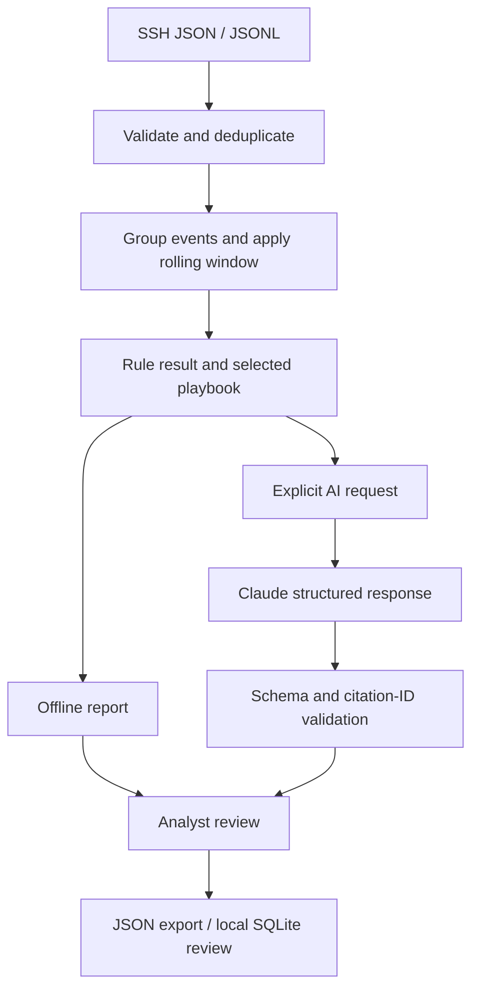

# Architecture

`core.py` owns deterministic behavior. Cases have a SHA-256-derived identifier
based on their normalized timeline. Ten-minute session gaps and rolling windows
serve different purposes: sessions collect related events, while rolling counts
detect a burst. No external IP reputation service is queried.

`llm.py` submits one HTTPS request to the fixed Anthropic Messages endpoint, rejects
redirects, and uses environment credentials. It requests a JSON schema, rejects
incomplete/refused responses and duplicate JSON fields, and checks allowed event IDs.
A complete Markdown JSON wrapper is tolerated; arbitrary JSON substring repair is not.
There are no tool calls, shell execution, or action APIs available to the model.

`app.py` preserves reports in the Streamlit session and resets them when input content
changes. Explicit consent gates dashboard model requests. `evaluate.py --live` is a
separate explicit opt-in path for eight bundled synthetic scenarios.

Model output is displayed as text for findings and recommendations. Review decisions
are saved with their case/report snapshot. They do not trigger external actions.
The data/model boundary reduces exposure but does not prove prompt-injection safety.
